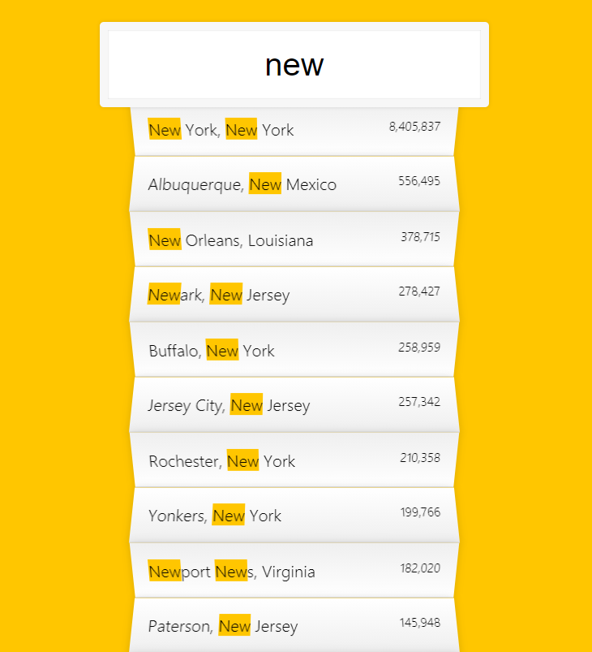
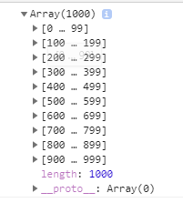
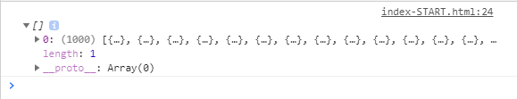
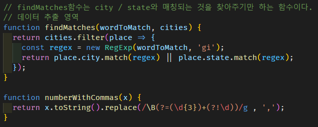
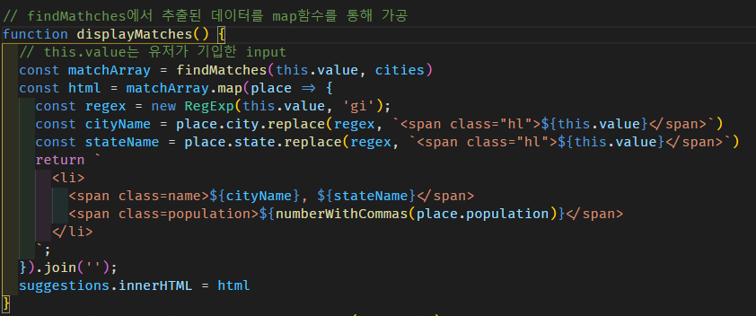
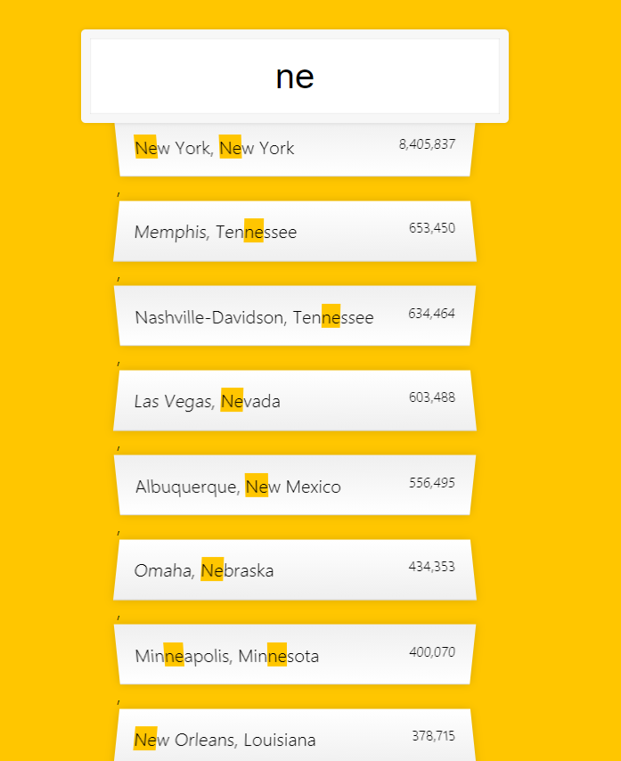

# [javascript 30] #6_Type Ahead
---
layout: post
title: [javascript 30] #6_Type Ahead
tags: [javascript30, javascript, TIL]
---

### 결과 화면

### 진행 과정

1. fetch를 통해 데이터 받아오기

   - 1000개의 데이터를 fetch를 통해 추출
   - `...data`를 하는 이유는 각 인덱스에 각 데이터를 받아오기 위함 !
     - `data`를 `push` 하면 cities[0]에 1000개의 데이터가 들어간다

2. `findMatches` - user가 기입한 input에 해당하는 `city || state`를 return 해 줄 함수

   - 정규식 객체 생성 문법 

     - regexp = `new RegExp(pattern, flag)`
     - regexp = `/pattern/(flag)`

   - 정규 표현식에는 6개의 플래그 지원함. 그 중 3가지를 자주 사용하므로 참고!

     - `i` - 대·소문자 구분 없이 검색함(`A`와 `a`에 차이 x)
     - `g` - 패턴과 일치하는 모든 것들을 찾음. 플래그가 없으면 패턴과 일치하는 첫 번째 결과만 반환
     - `m` - 다중 행 모드(multiline mode)를 활성화합니다.

     

     - 즉, displayMatches에서 findMatches함수를 사용할 때,  `this.value`가 wordToMatch에 해당하므로,  유저가 기입한 단어 중 `패턴과 일치하는 모든 것`을 `대, 소문자 구분 없이 검색`함

3. `displayMatches`- `findMaches`에서 추출한 데이터 정제

   
   
   - regex - 유저가 기입한 input을 정규 표현식으로 변환
   - suggestions.innerHTML에 html을 받아줄 것이므로, html형식으로 return 

- cityName, stateName을 span태그에 넣어줌
   - `numberWithCommas`함수를 통해 poplulation의 천 자리수에 `,`삽입

   - `join('')`으로 데이터 연결

     - 없을 경우, 추출한 데이터 사이 `,`로 분리됨

     
   
   - `suggestions.innerHTML = html` 구문으로 형식에 맞게 데이터 삽입

[fetch함수 이해하기](https://developer.mozilla.org/ko/docs/Web/API/Fetch_API/Fetch%EC%9D%98_%EC%82%AC%EC%9A%A9%EB%B2%95)

[정규표현식 이해하기](https://heropy.blog/2018/10/28/regexp/)

[정규표현식_플래그](https://ko.javascript.info/regexp-introduction)

[Element.innerHTML](https://developer.mozilla.org/ko/docs/Web/API/Element/innerHTML)